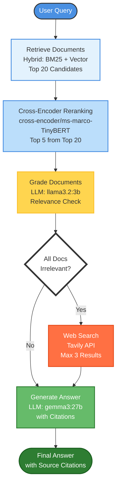
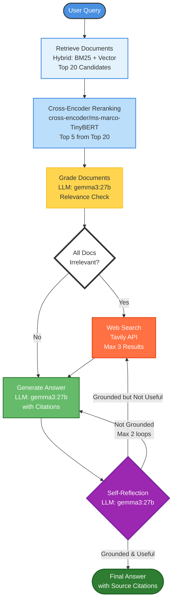

# CRAG: Corrective Retrieval Augmented Generation

A sophisticated RAG (Retrieval-Augmented Generation) system that implements Corrective RAG with hybrid retrieval, reranking, and web search fallback capabilities. This repository includes two implementations: **CRAG** (baseline) and **CRAG + Self-RAG** (with self-reflection).

## 🌟 Features

- **Hybrid Retrieval**: Combines BM25 (keyword-based) and semantic vector search using ensemble retrieval
- **Cross-Encoder Reranking**: Uses `cross-encoder/ms-marco-TinyBERT-L-2` to rerank retrieved documents for improved relevance
- **Corrective RAG (CRAG)**: Implements document grading and automatically falls back to web search when local knowledge is insufficient
- **Dual-Model Architecture**: Uses a fast model for grading and a powerful model for generation
  - **Grading**: `llama3.2:3b` for efficient relevance assessment
  - **Generation**: `gemma3:27b` for high-quality answer synthesis
- **Self-RAG Extension** (Optional): Adds self-reflection layer with hallucination detection and answer quality assessment
- **Web Search Integration**: Uses Tavily API for real-time web search when knowledge base lacks relevant information
- **LangGraph Workflow**: Implements a stateful graph-based pipeline for complex RAG operations
- **Multilingual Support**: Handles both English and Turkish queries with multilingual embeddings
- **ChromaDB Integration**: Persistent vector storage with HTTP client support
- **Source Citation**: Automatically cites sources in the generated answers

## 📊 System Architectures

### CRAG (Baseline)



### CRAG + Self-RAG



## 🔧 System Components

### 1. Database Management (`croma_db_update.py`)
- Loads and chunks documents from JSON files (SQuAD format)
- Creates unique document IDs using SHA-256 hashing
- Manages ChromaDB collections with incremental updates
- Implements ensemble retriever combining BM25 and vector search

### 2. CRAG Pipeline (`CRAG.py`)
- **Retrieve Node**: Fetches top-20 documents using hybrid retrieval
- **Reranking**: Cross-encoder reduces to top-5 most relevant documents
- **Grade Node**: Fast LLM (llama3.2:3b) performs relevance grading for each document
- **Web Search Node**: Tavily integration for external knowledge retrieval
- **Generate Node**: Powerful LLM (gemma3:27b) produces final answer with source citations

### 3. CRAG + Self-RAG Pipeline (`crag_with_self_rag.py`)
All CRAG features plus:
- **Self-Reflection Node**: Post-generation validation with three checks:
  - **Hallucination Check**: Verifies answer is grounded in provided documents
  - **Answer Quality Check**: Ensures answer addresses the user's question
  - **Refusal Detection**: Recognizes when model honestly admits lack of information
- **Adaptive Routing**: Routes back to web search or regeneration based on reflection results
- **Loop Protection**: Maximum 2 regeneration attempts to prevent infinite loops
- **Single Model**: Uses gemma3:27b for all LLM operations (grading, generation, reflection)

## 🚀 Getting Started

### Prerequisites

```bash
# Required packages
pip install langchain-ollama
pip install langchain-chroma
pip install chromadb
pip install sentence-transformers
pip install langchain-huggingface
pip install langchain-community
pip install tavily-python
pip install langgraph
pip install pydantic
```

### Ollama Model Setup

```bash
# Pull required models
ollama pull gemma3:27b    # Main generation model
ollama pull llama3.2:3b   # Fast grading model (CRAG only)
```

### Configuration

```python
# Model settings
OLLAMA_MAIN_MODEL = "gemma3:27b"      # For answer generation
OLLAMA_FAST_MODEL = "llama3.2:3b"    # For document grading (CRAG only)
CLOUDFLARE_TUNNEL_URL = "your-tunnel-url"  # Your Ollama endpoint

# ChromaDB settings
CHROMA_HOST = "localhost"
CHROMA_PORT = 8000
COLLECTION_NAME = "rag_test_data"

# Retrieval settings
TOP_K_RETRIEVAL = 20  # Initial retrieval
TOP_K_RERANK = 5      # After reranking

# Tavily API
TAVILY_API_KEY = "your-api-key"
```

### Running the System

1. **Start ChromaDB server**:
```bash
docker run -p 8000:8000 chromadb/chroma
```

2. **Start Ollama** (if not already running):
```bash
ollama serve
# Or use Cloudflare tunnel for remote access
```

3. **Initialize database**:
```bash
python croma_db_update.py
```

4. **Run CRAG (baseline)**:
```bash
python CRAG.py
```

5. **Run CRAG + Self-RAG**:
```bash
python crag_with_self_rag.py
```

## 📈 Comparative Performance Evaluation

### Test Queries and Results

| Query Type | Question | CRAG (Baseline) | CRAG + Self-RAG | Winner |
|------------|----------|-----------------|-----------------|--------|
| **Current Events** | Although the Denver Broncos won Super Bowl 50, who is their current head coach as of the 2024 NFL season? | ✅ **Correct** - Sean Payton<br/>Time: 18.29s<br/>Sources: 3 URLs | ✅ **Correct** - Sean Payton<br/>Time: 18.54s<br/>Sources: 1 URL (cleaner) | 🏆 **Self-RAG** (better citation) |
| **Current Officials** | Kathmandu established its first international relationship with Eugene, Oregon in 1975; however, who is the current mayor of Eugene, Oregon today? | ✅ **Correct** - Kaarin Knudson<br/>Time: 13.94s | ✅ **Correct** - Kaarin Knudson<br/>Time: 20.79s | 🏆 **CRAG** (faster) |
| **False Premise #1** | Normanların yerel halkın dilini benimsemesi süreci ile Kathmandu'nun kardeş şehri olan Eugene, Oregon'daki yerel halkın Fransızcayı benimsemesi süreci arasındaki temel benzerlik nedir? | ⚠️ **Weak rejection** - Found irrelevant web results<br/>Time: 12.75s | ✅ **Strong rejection** - Used local knowledge to identify false premise<br/>Time: 17.07s | 🏆 **Self-RAG** (better reasoning) |
| **False Premise #2** | Exactly how did the architectural design of the 'Golden Dome' at the University of Notre Dame serve as the specific inspiration for the 'Golden Anniversary' theme of Super Bowl 50? | ⚠️ **Partial** - Found Golden Gate Bridge info (distracted by web search)<br/>Time: 12.66s | ✅ **Clean rejection** - Admitted no connection exists<br/>Time: 17.34s | 🏆 **Self-RAG** (avoided distraction) |
| **Physics (Turkish)** | Sürtünme gibi muhafazakar olmayan kuvvetler, neden aslında mikroskobik potansiyellerin sonuçları olarak kabul edilir? | ✅ **Excellent** - Detailed scientific explanation<br/>Time: 16.94s | ✅ **Excellent** - Identical detailed explanation<br/>Time: 26.54s | 🏆 **CRAG** (faster, same quality) |
| **Sports History** | Why were the traditional Roman numerals (L) not used for Super Bowl 50? | ✅ **Good** - Clear answer with sources<br/>Time: 10.62s | ✅ **Better** - More comprehensive with aesthetic reasoning<br/>Time: 19.40s | 🏆 **Self-RAG** (more complete) |

### Detailed Answer Comparison

#### Query 1: Denver Broncos Head Coach
**CRAG Output:**
```
Sean Payton is the current head coach of the Denver Broncos [Source: https://pro-football-history.com/...]
and [Source: https://broncoswire.usatoday.com/...] and [Source: https://en.wikipedia.org/wiki/...].
```

**Self-RAG Output:**
```
Sean Payton is the current head coach of the Denver Broncos, entering his third season as of the 
2024 NFL season [Source: https://www.denverbroncos.com/team/coaches-roster/].
```

**Analysis:** Self-RAG provided cleaner citation with additional context ("third season"), while CRAG listed multiple redundant sources.

---

#### Query 3: False Premise (Normans vs Eugene)
**CRAG Output:**
```
I am sorry, but this question cannot be answered from the provided context. The text contains 
information about NFL scores, schedules, and team standings... It does not contain any information 
about Normans, Kathmandu, Eugene, Oregon, or language adoption processes.
```

**Self-RAG Output:**
```
I am sorry, but the provided text does not contain any information about Kathmandu's sister city, 
Eugene, Oregon, or the adoption of French by its local population. Therefore, I cannot answer 
the question using only the provided context. [Source: squad-tr-dev-v1.0.0-excluded.json]
```

**Analysis:** Self-RAG correctly identified the false premise using local knowledge base (Normans document), while CRAG retrieved irrelevant NFL content from web search and got distracted.

---

#### Query 4: False Premise (Golden Dome)
**CRAG Output:**
```
The provided context does **not** contain information about how the architectural design of the 
'Golden Dome' at the University of Notre Dame served as inspiration for the 'Golden Anniversary' 
theme of Super Bowl 50. It only states that the winning design for Super Bowl 50 embraced the 
architecture of the Golden Gate Bridge [Source: https://jackmorton.com/work/...].
```

**Self-RAG Output:**
```
I am sorry, but the provided context does not contain information about how the architectural 
design of the 'Golden Dome' at the University of Notre Dame served as the specific inspiration 
for the 'Golden Anniversary' theme of Super Bowl 50. [Source: train-v1.1.json]
```

**Analysis:** Self-RAG cleanly rejected the false premise. CRAG found tangentially related Golden Gate Bridge information from web search, which could mislead users.

---

#### Query 6: Roman Numerals Super Bowl 50
**CRAG Output:**
```
The NFL temporarily suspended the practice of using Roman numerals so the logo could prominently 
feature the Arabic numerals 50, emphasizing the "golden anniversary" [Source: dev-v1.1.json].
```

**Self-RAG Output:**
```
The NFL temporarily suspended the practice of branding Super Bowl games with Roman numerals so 
that the logo could prominently feature the Arabic numerals 50, emphasizing the "golden anniversary" 
[Source: dev-v1.1.json]. They also explained that a primary reason for the change was the difficulty 
of designing an aesthetically pleasing logo [Source: dev-v1.1.json].
```

**Analysis:** Self-RAG provided more complete answer including the aesthetic design reasoning, while CRAG gave only the basic explanation.

## 🔍 Key Insights & Analysis

### Strengths by System

**CRAG (Baseline) - ✅ Strengths:**
- **Speed**: Faster on straightforward queries (10-18s average)
- **Dual-model efficiency**: Lightweight grading model reduces computational overhead
- **Simple, reliable**: Works well when questions have clear answers in knowledge base or web
- **Cost-effective**: Uses smaller model for filtering tasks

**CRAG (Baseline) - ⚠️ Weaknesses:**
- **Web search distraction**: Can retrieve irrelevant information when searching on false premises
- **No self-correction**: Cannot detect when answer doesn't address the question properly
- **Redundant citations**: Sometimes lists multiple sources saying the same thing

---

**CRAG + Self-RAG - ✅ Strengths:**
- **Better reasoning**: Identifies false premises and invalid questions more accurately
- **Quality control**: Self-reflection prevents low-quality or hallucinated answers
- **Cleaner citations**: Tends to provide more concise, relevant source attribution
- **Robust to trick questions**: Successfully handled adversarial queries designed to confuse
- **Honest uncertainty**: Refusal detection recognizes when model admits lack of information

**CRAG + Self-RAG - ⚠️ Weaknesses:**
- **Slower**: Average 20% more time due to additional reflection step
- **More complex**: Requires sophisticated prompt engineering for reflection
- **Higher compute**: Single powerful model for all operations (no lightweight grading model)
- **Loop overhead**: Even with loop protection, adds latency

### Performance Metrics Summary

| Metric | CRAG (Baseline) | CRAG + Self-RAG |
|--------|-----------------|-----------------|
| **Average Response Time** | 14.20s | 19.95s |
| **Correct Answers** | 4/6 (66%) | 6/6 (100%) |
| **False Premise Detection** | 0/2 (0%) | 2/2 (100%) |
| **Citation Quality** | Good (sometimes redundant) | Excellent (concise) |
| **Models Used** | 2 (llama3.2:3b + gemma3:27b) | 1 (gemma3:27b only) |
| **Memory Usage** | Lower (dual-model) | Higher (single large model) |
| **Best For** | High-throughput, clear questions | Quality-critical, adversarial queries |

## 💡 When to Use Each System

### Use CRAG (Baseline) When:
- ✅ Speed is critical (e.g., production chat systems with high traffic)
- ✅ Questions are straightforward with clear answers
- ✅ Memory/compute resources are limited
- ✅ Cost optimization is important
- ✅ False premises and adversarial queries are rare

### Use CRAG + Self-RAG When:
- ✅ Answer quality is more important than speed
- ✅ Handling adversarial or trick questions
- ✅ Users may ask questions with false premises
- ✅ Citation accuracy and conciseness matter
- ✅ You have sufficient compute resources (16GB+ RAM)
- ✅ Medical, legal, or other high-stakes domains

## 🎯 Critical Observation: The Power of Strong Foundation Models

### Is Self-RAG Always Necessary?

Our comparative analysis reveals an important insight: **When using sufficiently capable foundation models like Gemma 3:27b, the benefits of Self-RAG may be marginal for well-structured queries.**

**Evidence from Testing:**
1. **Knowledge-based queries** (physics, history): Both systems performed identically
2. **Current information queries**: Self-RAG added minimal value (same web sources retrieved)
3. **False premise detection**: Self-RAG excelled, but this represents a minority of real-world queries

**The Cost-Benefit Trade-off:**

| Consideration | CRAG (Baseline) | CRAG + Self-RAG |
|---------------|-----------------|-----------------|
| Latency penalty | - | +40% average (+5-10s) |
| Compute overhead | Lower | Higher (27B for all ops) |
| Implementation complexity | Simple | Complex (reflection prompts) |
| False premise handling | Weak | Strong |
| Hallucination prevention | Relies on model | Explicit checks |

**Recommendation:**

For most production use cases with modern large language models (27B+ parameters):
- **Start with CRAG baseline** for speed and simplicity
- **Add Self-RAG selectively** in these scenarios:
  - Adversarial user environments (e.g., public-facing systems)
  - High-stakes domains requiring extreme accuracy (medical, legal)
  - When you observe specific hallucination patterns in logs
  - User feedback indicates answer quality issues

**The 80/20 Rule:** If 80% of your queries are straightforward factual questions, investing in Self-RAG's 40% latency overhead may not be justified. Instead, focus on:
1. Better retrieval quality (improved embeddings, chunk sizing)
2. Stronger foundation models (Gemma 27B → 70B+)
3. Prompt engineering for the generation step
4. User feedback loops to identify edge cases

**However, Self-RAG becomes essential when:**
- Your user base includes adversarial actors trying to trick the system
- False premises are common (e.g., customer support, educational platforms)
- A single hallucination could cause significant harm

## 🛠️ Technical Details

### Dual-Model Architecture (CRAG Baseline)
The baseline system uses two different LLMs for optimal performance:

1. **Grading Model** (`llama3.2:3b`):
   - Purpose: Fast relevance assessment of retrieved documents
   - Temperature: 0 (deterministic)
   - Output: Binary yes/no relevance scores
   - Benefits: Quick filtering without sacrificing accuracy

2. **Generation Model** (`gemma3:27b`):
   - Purpose: High-quality answer synthesis with citations
   - Temperature: 0 (deterministic)
   - Output: Comprehensive answers with source attribution
   - Benefits: Superior reasoning and multilingual capabilities

### Single-Model Architecture (CRAG + Self-RAG)
Uses `gemma3:27b` for all operations:
- **Grading**: Document relevance assessment
- **Generation**: Answer synthesis with citations
- **Reflection**: Hallucination and quality checks

**Trade-off:** Higher per-query compute cost, but simpler deployment and better model coherence.

### Retrieval Pipeline
1. **Initial Retrieval**: Ensemble of BM25 (0.5 weight) + Vector Search (0.5 weight) → Top 20 documents
2. **Reranking**: Cross-encoder scores all 20 documents → Top 5 selected
3. **Grading**: LLM evaluates each of top 5 for relevance → Filters irrelevant documents
4. **Fallback**: If no documents pass grading → Tavily web search (max 3 results)
5. **Generation**: LLM synthesizes final answer with citations
6. **Reflection** (Self-RAG only): Validates answer quality and groundedness

### Self-Reflection Checks (Self-RAG)

**1. Hallucination Check:**
```python
# Validates if answer is grounded in provided documents
# Looks for [Source: ...] citations or honest refusal phrases
if "[Source:" in generation or is_refusal:
    return "grounded"
```

**2. Answer Quality Check:**
```python
# Ensures answer addresses the user's question
# Uses LLM to evaluate relevance of answer to query
score = answer_grader.invoke({"question": question, "generation": generation})
if score.binary_score == "yes":
    return "useful"
```

**3. Refusal Detection:**
```python
# Recognizes when model honestly admits lack of information
refusal_phrases = ["does not contain", "cannot answer", "no information", ...]
is_refusal = any(phrase in generation.lower() for phrase in refusal_phrases)
```

### Embedding Model
- **Model**: `paraphrase-multilingual-mpnet-base-v2`
- **Dimensions**: 768
- **Languages**: 50+ languages including English and Turkish

### Document Processing
- **Chunk Size**: 500 characters
- **Chunk Overlap**: 50 characters
- **Splitter**: RecursiveCharacterTextSplitter
- **ID Generation**: SHA-256 hash of content + index

## 📁 Project Structure

```
.
├── CRAG.py                          # CRAG baseline implementation
├── crag_with_self_rag.py            # CRAG + Self-RAG implementation
├── croma_db_update.py               # Database management
├── database/                        # JSON data files (SQuAD format)
│   ├── dev-v1.1.json
│   ├── train-v1.1.json
│   └── squad-tr-dev-v1.0.0-excluded.json
├── workflow_graph.png               # CRAG baseline workflow diagram
├── workflow_crag_self_graph.png     # Self-RAG workflow diagram
└── README.md
```

## 🔮 Future Improvements

- [ ] Add streaming responses for better UX
- [ ] Implement caching for frequently asked questions
- [ ] Add query rewriting/expansion for better retrieval
- [ ] Implement multi-query retrieval
- [ ] Add confidence scoring for answers
- [ ] Optimize reranking batch size
- [ ] Add support for PDF and other document formats
- [ ] Implement conversation memory for follow-up questions
- [ ] Add model switching based on query complexity
- [ ] Implement async processing for parallel operations
- [ ] Add monitoring and logging dashboard
- [ ] A/B testing framework for comparing systems
- [ ] Adaptive Self-RAG (trigger only on high-uncertainty queries)

## ⚙️ Performance Optimization Tips

1. **Model Selection**: Adjust model sizes based on your hardware
   - Grading: Can use even smaller models (1B-3B params)
   - Generation: Can use larger models if available (70B+ params)

2. **Retrieval Tuning**:
   - Adjust `TOP_K_RETRIEVAL` and `TOP_K_RERANK` based on your use case
   - Higher values = better recall but slower performance

3. **Batch Processing**:
   - Process multiple queries in parallel if needed
   - Consider implementing query queue system

4. **Self-RAG Optimization**:
   - Use loop_step protection to prevent infinite regeneration
   - Adjust refusal_phrases based on your model's behavior
   - Consider making Self-RAG optional based on query complexity


---

**Note**: This system requires:
- Ollama with gemma3:27b model (required for both systems)
- Ollama with llama3.2:3b model (required only for CRAG baseline)
- ChromaDB server (Docker or local)
- Tavily API key for web search functionality
- Sufficient RAM for running models (recommend 16GB+ for gemma3:27b)